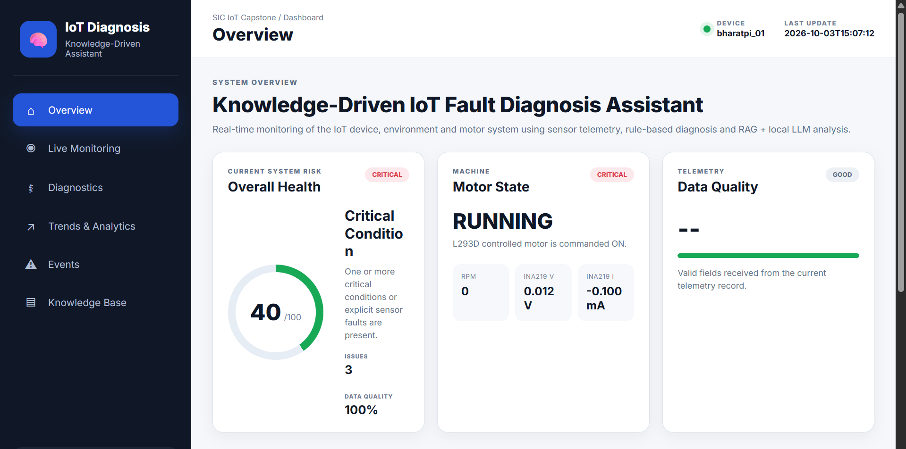

# Knowledge-Driven IoT Fault Diagnosis Assistant



A knowledge-driven IoT fault diagnosis system that combines real-time sensor telemetry, MQTT communication, rule-based fault monitoring, Retrieval-Augmented Generation (RAG), and a local Generative AI model to support IoT device diagnosis.

---

## Overview

IoT devices can produce large amounts of sensor data, but raw telemetry alone does not explain why an abnormal condition is occurring.

This project combines:

- Real-time IoT telemetry
- MQTT communication
- Sensor health monitoring
- Rule-based fault detection
- SQLite telemetry storage
- Web-based monitoring dashboard
- Retrieval-Augmented Generation (RAG)
- Local Generative AI
- Knowledge-driven diagnostic explanations

The core design principle is:

> **Deterministic rules establish what is happening; RAG provides relevant engineering knowledge; the local LLM explains the condition and recommends checks.**

---

## System Architecture

```text
┌─────────────────────────────────────────────────────────────┐
│                    IoT SENSING PLATFORM                    │
│                                                             │
│  DHT22 ─────── Temperature / Humidity                       │
│  PIR ───────── Motion                                       │
│  HC-SR04 ───── Distance                                     │
│  LM393 ─────── Sound Event                                  │
│  A3144 ─────── Motor RPM                                    │
│  INA219 ────── Auxiliary Electrical Load                   │
│  DC Motor ──── Actuator                                     │
│                                                             │
│                     Bharat Pi / Controller                  │
└──────────────────────────┬──────────────────────────────────┘
                           │
                           │ MQTT
                           ▼
                  ┌─────────────────┐
                  │ MQTT Broker     │
                  │   Mosquitto     │
                  └────────┬────────┘
                           │
                           ▼
                ┌──────────────────────┐
                │ Telemetry Receiver   │
                │ Python + Paho MQTT   │
                └──────────┬───────────┘
                           │
                           ▼
                    ┌─────────────┐
                    │   SQLite    │
                    │  Telemetry  │
                    └──────┬──────┘
                           │
             ┌─────────────┴──────────────┐
             │                            │
             ▼                            ▼
   ┌──────────────────┐        ┌─────────────────────┐
   │ Rule-Based       │        │ Web Dashboard       │
   │ Fault Detection  │        │ Flask + JavaScript  │
   └────────┬─────────┘        └─────────────────────┘
            │
            ▼
   ┌──────────────────────────────┐
   │ RAG Knowledge Retrieval      │
   │ ChromaDB + Knowledge Base    │
   └──────────────┬───────────────┘
                  │
                  ▼
   ┌──────────────────────────────┐
   │ Local Generative AI          │
   │ LM Studio + Qwen3-VL 4B      │
   └──────────────┬───────────────┘
                  │
                  ▼
        Knowledge-Driven
        Diagnostic Explanation